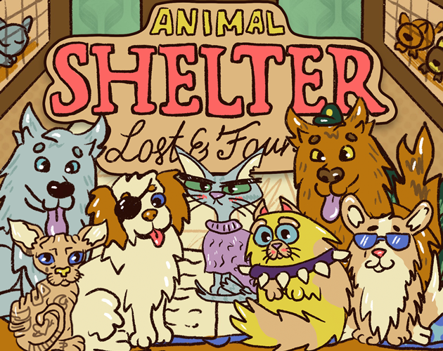

 # [GGJ21](https://teamon.itch.io/ggj21)
Made in X hours for [Global Game Jam Online 2021](https://globalgamejam.org/2021/)  
Theme: THEME  

Short desc  

 

Long desc  

# Downloads and Links
Available in [Windows, OSX, Linux, Android and Web](https://teamon.itch.io/ggj21).  
Consider downloading a game instead of playing the web version for better performance and stability.  
If you encounter any problem, please leave a issue!  

#### Mac Version Notes:
If you get "this package is from an unidentified developer" right click (or control-click) and select open. You should now get the option to open anyways.

#### Linux Version Notes:
Make sure to set the x86_64 as executable before running.

#  How to play
 * Controls
 * Do this to win
 * Do that to lose
 
#  Tips
 * Tips

# What is Global Game Jam?
The Global Game Jam is the world's largest game jam event taking place around the world at physical locations. Think of it as a hackathon focused on game development. It is the growth of an idea that in today’s heavily connected world, we could come together, be creative, share experiences and express ourselves in a multitude of ways using video games – it is very universal. The weekend stirs a global creative buzz in games, while at the same time exploring the process of development, be it programming, iterative design, narrative exploration or artistic expression. It is all condensed into a 48 hour development cycle. The GGJ encourages people with all kinds of backgrounds to participate and contribute to this global spread of game development and creativity. [More here...](https://globalgamejam.org/about)

# Diversifiers
 * Share the source code of your project

# Used tools:
 * Unity 2020.2.0f1
 * Visual Studio 2019
 * Adobe Photoshop 2020
 * sfxr

# Used assets:
 * Unity game template - https://github.com/Team-on/UnityGameTemplate
 * Assets from template - https://github.com/Team-on/UnityGameTemplate/wiki/Used-assets
 * link - where used

# Screenshots
  
  
  
